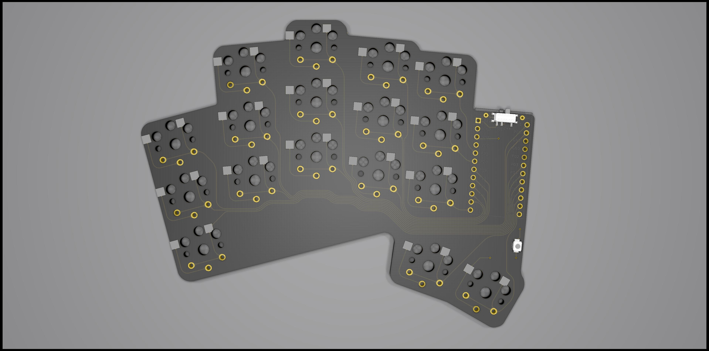

# a-dux-bluetooth

Note: This needs further work, some routes aren’t connected properly. Please use for idear only!

Simplified versions of [tapioki](https://github.com/tapioki)'s [Architeuthis dux](https://github.com/tapioki/cephalopoda/tree/main/Architeuthis%20dux) with puck and TRRS removed, cutout adjusted, power switch and reset switch added. Desiged for wireless use with niec!nanos.

Board is reversable so controlles facedown on left and face up on the right. The power switch and reset switch should work on both sides too. 

CURRENTLY UNTESTED!

